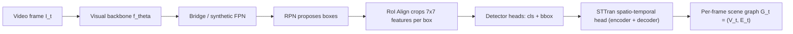

# Modernizing Dynamic Scene Graph Generation

> **Beating STTran on the Action Genome benchmark by replacing its CNN backbone with a frozen DINOv2 foundation model — while keeping every other piece of the original detector-first pipeline intact.**

CMPE 297 Special Topics in Computer Vision (Spring 2026), San José State University.

---

## TL;DR

We took the [STTran](https://github.com/yrcong/STTran) (Cong et al., ICCV 2021) framework and modernized just one thing — the visual backbone. The rest of the pipeline (Faster R-CNN detector shell, RPN, RoI Align, STTran spatio-temporal graph head, evaluation harness) stayed identical across all three phases, so every gain is attributable to the backbone alone.

| Metric (with-constraint R@20) | Base STTran (ResNet-101) | Phase 2 (plain ViT) | **Phase 3 (frozen DINOv2)** |
|---|---|---|---|
| Detector mAP@0.5 | 24.60 | 23.19 | **24.25** |
| **SGCLS R@20** (headline) | 47.50 | 30.75 | **52.88** |
| **SGDET R@20** | 34.10 | 23.07 | **40.41** |
| PredCLS R@20 | 71.80 | 44.95 | 71.71 |

**Frozen DINOv2 features beat the original STTran paper on SGCLS and SGDET** while training only the bridge, the detector neck/heads, and the STTran graph head — the 86M-parameter backbone never receives a single gradient update.

---

## Table of contents

- [Project goal and scope](#project-goal-and-scope)
- [Architecture](#architecture)
- [Three-phase plan](#three-phase-plan)
- [Phase 2 ViT integration: the three bugs we fixed](#phase-2-vit-integration-the-three-bugs-we-fixed)
- [Phase 3 frozen-DINOv2 design](#phase-3-frozen-dinov2-design)
- [Repository layout](#repository-layout)
- [Reproducing the results](#reproducing-the-results)
- [Walkthrough branch](#walkthrough-branch)
- [Authors and contributions](#authors-and-contributions)
- [References](#references)

---

## Project goal and scope

Dynamic Scene Graph Generation (DSGG) takes a video and predicts, for every frame, a directed graph of (subject, predicate, object) triplets — `person -- looking_at -- cup`, `person -- holding -- cup`, `cup -- on_top_of -- table`. The dominant baseline, STTran, builds these graphs on top of a Faster R-CNN detector with a ResNet-101 backbone.

We hypothesized two things:

1. ViT's global self-attention should help relationship detection more than ResNet's local convolutions, because relations like `looking_at` or `in_front_of` need information from across the frame, not just the local box.
2. A *frozen* foundation model (DINOv2), already pretrained on 142M images, should outperform a from-scratch fine-tuned ViT on Action Genome — the smaller corpus is not enough to teach a ViT good detection features alone.

Phase 2 produced an honest ViT scorecard but did not beat ResNet on its own. Phase 3 vindicated hypothesis (2) cleanly: frozen DINOv2 + corrected pipeline + small trainable bridge beat the original STTran paper on the hardest metrics.

---

## Architecture

Every phase keeps the same outer skeleton. Only the **backbone** and **bridge** change.



| Component | Phase 1 | Phase 2 | Phase 3 |
|---|---|---|---|
| Backbone | ResNet-101 | plain ViT-B/16 (`timm`) | **frozen** DINOv2 ViT-B/14 |
| Bridge | native ResNet C4 (no separate module) | `phase2_vitdet/SimpleViTDetFPN` | `phase3_dinov2/DINOv2Bridge` |
| RPN, RoI Align, detector heads | inherited from `faster_rcnn_ag.pth` | retrained on AG with new backbone | retrained on AG with frozen backbone |
| STTran graph head | trained Stage 2 | trained Stage 2 | trained Stage 2 |
| Detector norm | BatchNorm | **GroupNorm(32)** | **GroupNorm(32)** |

Same RPN. Same RoI Align. Same STTran head. Same evaluation harness. The cleanest possible backbone ablation.

---

## Three-phase plan

### Phase 1 — Reproduce STTran with ResNet-101

Goal: hit the published STTran numbers on Action Genome with the original ResNet-101 backbone, so we have a trustworthy harness before changing anything. We hit parity (24.6 mAP, 71.8 PredCLS R@20, 47.5 SGCLS R@20).

### Phase 2 — Replace the backbone with a plain ViT

Goal: swap ResNet-101 for a `timm` ViT-B/16, wrapped in a ViTDet-style synthetic feature pyramid that lets the inherited Faster R-CNN heads consume single-scale ViT features. Stabilizing this phase required diagnosing and fixing three serious bugs (see below). After the fixes, Phase 2 was an honest ViT baseline at 23.19 mAP — slightly behind ResNet, consistent with training a ViT from scratch on a small AG-only detector corpus.

### Phase 3 — Drop in a frozen DINOv2 foundation backbone

Goal: test whether a frozen, general-purpose foundation model can outperform task-specific fine-tuning. Phase 3 is implemented as a parallel branch (`phase3_dinov2/`) that reuses the corrected Phase-2 detector shell + STTran heads but adds DINOv2-specific files for the backbone, the bridge, and the preprocessing source-of-truth. Result: SGCLS R@20 = 52.88 vs base 47.5; SGDET R@20 = 40.41 vs base 34.1.

---

## Phase 2 ViT integration: the three bugs we fixed

### Bug 1 — BF16 "Poison Pill" in the loss

**Symptom.** Mid-epoch the loss randomly returned `NaN` / `Inf`, poisoning the entire batch's gradient.

**Root cause.** H100 mixed-precision uses BF16 (8-bit exponent, only 7-bit mantissa). The `-log p` term inside cross-entropy underflowed in BF16 when `p` was small; same for `log σ(z)` inside relation BCE.

**Fix.** Explicitly cast logits to FP32 before softmax / sigmoid / loss in [`STTran/train.py:997-999`](STTran/train.py). Backbone forward stays BF16 (fast); loss math runs FP32 (stable). A second sub-fix re-wrote Stage 1 to compute object loss only — the original Stage 1 was silently dropping detector gradients via the relation-loss `NaN`-skip mask.

### Bug 2 — BatchNorm vs GroupNorm config drift dropped 209 detector keys

**Symptom.** Detector mAP went to **zero** at evaluation time. Training looked fine, the checkpoint saved without errors, but every eval-time box returned garbage.

**Root cause.** Faster R-CNN ships with BatchNorm. ViT-based detectors typically use GroupNorm. Training with `DETECTOR_BN_MODE=groupnorm` and evaluating with the env var unset (defaulting to `batchnorm`) silently dropped **209 BN running-buffer pairs** at `load_state_dict(strict=False)` time, leaving random-init BN buffers at eval.

**Fix.** [`STTran/lib/object_detector.py:32-50`](STTran/lib/object_detector.py) defines `_replace_batchnorm_with_groupnorm(module, preferred_groups=32)`, applied at lines 187-206 conditional on `DETECTOR_BN_MODE=groupnorm`. The launcher scripts now default this to `groupnorm` everywhere for ViT/DINOv2 phases, so train and eval can no longer drift.

### Bug 3 — The Mixed-Path Bug

**Symptom.** Phase 2 epoch-0 ViT model showed PredCLS R@20 ≈ 44 but SGCLS R@20 ≈ 0.013. Cross-mode comparisons were uninterpretable.

**Root cause.** The GT-box branch of the detector was extracting features through the *legacy ResNet base* (`self.fasterRCNN.RCNN_base(...)`) for PredCLS and SGCLS, while only SGDET had been rewired to call the new ViT path through `self.vitdet(...)`. The three evaluation modes were not even using the same backbone.

**Fix.** [`STTran/lib/object_detector.py:758-771`](STTran/lib/object_detector.py) routes every mode through `self._extract_base_features(...)`, which dispatches on `backbone_name`. After the fix, SGCLS R@20 jumped from 0.013 to 0.297 on the *same checkpoint*. We additionally enforce a runtime mode-consistency invariant in Phase 3 via `PHASE3_ASSERT_DINOV2_PATH=1`. A companion fix in [`STTran/lib/sttran.py:49-69`](STTran/lib/sttran.py) replaced a destructive duplicate-relabel heuristic with a configurable IoU-based policy (`SGCLS_DUPLICATE_POLICY=iou`, `SGCLS_LABEL_SOURCE=detector`), now defaulted in every launcher.

---

## Phase 3 frozen-DINOv2 design

Phase 3 is intentionally a **parallel branch**, not a mutation of Phase 2. Same detector shell, same STTran heads, but a dedicated DINOv2 backbone bridge plus its own data pipeline so the working Phase 2 path stays clean.


Key design choices:

- **Frozen backbone.** [`phase3_dinov2/dinov2_bridge.py:120-123`](phase3_dinov2/dinov2_bridge.py) sets `requires_grad_(False)` on every backbone parameter and overrides `train()` to keep the backbone in eval mode permanently. The forward runs inside `torch.no_grad()` to avoid building an autograd graph through DINOv2's 86M parameters. This is what lets us scale up the batch size from 8 (Phase 2) to 12 (Phase 3) on the same H100.
- **Single source of truth for preprocessing.** [`phase3_dinov2/preprocess.py`](phase3_dinov2/preprocess.py) defines a frozen `DINOv2VisualConfig` dataclass that the bridge, the graph dataloader (`STTran/dataloader/action_genome_phase3.py`), and the detector dataloader (`STTran/dataloader/action_genome_detector_phase3.py`) all read from. Mean / std / interpolation come from `timm.resolve_data_config(...)` for `vit_base_patch14_dinov2` — i.e., DINOv2's own native preprocessing — not Faster R-CNN defaults.
- **Path assertions and per-mode runtime logging.** Setting `PHASE3_ASSERT_DINOV2_PATH=1` (default in every Phase 3 launcher) makes the wrapper assert at runtime that the DINOv2 path is in use. The bridge prints a structured log line the first time each evaluation mode runs (`Phase3 backbone path [predcls]: backbone=dinov2 bridge=DINOv2Bridge feature_shape=... preprocessing=... frozen=True ...`) so any silent path divergence would surface in epoch 0.

---

## Repository layout

```
DSGG/
+-- STTran/                       # Main codebase (forked + augmented from Cong et al. STTran)
|   +-- lib/
|   |   +-- object_detector.py        # ResNet/ViT detector shell, mode-consistency fix
|   |   +-- object_detector_phase3.py # Phase 3 wrapper with DINOv2-path assertion
|   |   +-- sttran.py                 # STTran graph head + SGCLS duplicate-policy fix
|   |   +-- transformer.py            # Spatio-temporal encoder/decoder
|   +-- dataloader/
|   |   +-- action_genome.py                  # Phase 1/2 graph dataloader
|   |   +-- action_genome_detector.py         # Phase 1/2 detector dataloader
|   |   +-- action_genome_phase3.py           # Phase 3 graph dataloader (DINOv2 preproc)
|   |   +-- action_genome_detector_phase3.py  # Phase 3 detector dataloader
|   +-- train_detector_stage1.py          # Phase 1/2 Stage-1 detector pretraining
|   +-- train_detector_stage1_phase3.py   # Phase 3 Stage-1 (frozen backbone)
|   +-- train.py                          # Phase 1/2 Stage-2 graph training
|   +-- train_phase3.py                   # Phase 3 Stage-2 graph training
|   +-- evaluate_only.py                  # Phase 1/2 evaluation
|   +-- evaluate_only_phase3.py           # Phase 3 evaluation
|   +-- evaluate_detector_map.py          # Detector-only mAP evaluation
|   +-- scripts/                          # SLURM launchers for SJSU H100 cluster
|       +-- train_detector_stage1_h100.sbatch
|       +-- train_phase3_dinov2_h100.sbatch
|       +-- eval_phase3_dinov2_h100.sbatch
|       +-- ... (all per-phase, per-stage launchers)
+-- phase2_vitdet/                # Phase 2 ViTDet bridge
|   +-- simple_vitdet_fpn.py          # Synthetic-pyramid bridge (p2/p3/p4/p5)
|   +-- adapter.py                    # Thin wrapper exposing the bridge to object_detector.py
+-- phase3_dinov2/                # Phase 3 frozen-DINOv2 bridge
|   +-- dinov2_bridge.py              # Frozen-backbone bridge module
|   +-- preprocess.py                 # Single source of truth for preprocessing
+-- ActionGenome/                 # Action Genome dataset prep / annotation tooling
+-- gdown/                        # Local copy of `gdown` for downloading dataset assets
+-- tools/                        # Utility scripts (e.g. `ffmpeg_threads1.sh`)
+-- README.md                     # This file
```

---

## Reproducing the results

### Hardware

All training and evaluation runs were executed on the **SJSU HPC H100 cluster**, single-node single-GPU jobs, with BF16 mixed precision via `torch.autocast(device_type='cuda', dtype=torch.bfloat16)`.

### Dataset

[Action Genome](https://github.com/JingweiJ/ActionGenome) (Ji et al., CVPR 2020), built on top of [Charades](https://prior.allenai.org/projects/charades). 26 relationship classes split across attention / spatial / contact families. After runtime filtering of frames without a valid `person_bbox`:

- **Training**: 167,068 valid frames from 7,649 videos
- **SGCLS / SGDET evaluation**: 54,429 valid frames from 1,737 videos
- **PredCLS evaluation**: 56,923 valid frames from 1,750 videos (slightly less filtering)

Dataset preparation tooling lives in [`ActionGenome/`](ActionGenome).

### Two-stage training schedule

For every backbone we follow the paper-faithful detector-first flow:

1. **Stage 1** — train the detector with `λ_rel = 0` (object loss only) until detector mAP@0.5 stabilizes. Best checkpoint selected by mAP@0.5 evaluation, with downstream re-ranking by short SGDET R@20 sweeps in Phase 3.
2. **Stage 2** — freeze the detector and train the STTran graph head end-to-end on attention / spatial / contact relation losses.

### SLURM launchers

The `STTran/scripts/` directory contains per-phase, per-stage launchers. Quickstart examples:

```bash
# Phase 1 baseline (Stage 2 only — uses published faster_rcnn_ag.pth)
sbatch STTran/scripts/train_sttran_h100.sbatch

# Phase 2: ViT Stage 1 detector pretraining
bash STTran/scripts/submit_detector_stage1_vitdet_mainline_long.sh

# Phase 2: Stage 2 graph training on best ViT detector checkpoint
bash STTran/scripts/submit_sttran_stage2_vitdet_nonmae_best.sh

# Phase 3: DINOv2 Stage 1 detector pretraining (full run)
bash STTran/scripts/submit_detector_stage1_phase3_dinov2_full.sh

# Phase 3: Stage 2 graph training
sbatch STTran/scripts/train_phase3_dinov2_h100.sbatch

# Phase 3: evaluation across PredCLS / SGCLS / SGDET
sbatch STTran/scripts/eval_phase3_dinov2_h100.sbatch
```

Every launcher exports the corrected defaults that Phase 2 taught us:

```bash
DETECTOR_BN_MODE=groupnorm           # avoids the 209-key BN/GN drift bug
SGCLS_DUPLICATE_POLICY=iou           # avoids the destructive duplicate-relabel
SGCLS_LABEL_SOURCE=detector          # use upstream RCNN classifier head, not the mini-decoder
PHASE3_ASSERT_DINOV2_PATH=1          # runtime assertion that DINOv2 is the active backbone
AMP_DTYPE=bf16                       # mixed precision (with FP32 cast on logits inside the loss)
```

### Software requirements

- Python 3.10
- PyTorch with CUDA support (BF16 requires Ampere or newer; we used Hopper / H100)
- `timm` for the ViT and DINOv2 backbones
- `cv2`, `numpy`, etc. for the AG dataloader

See `STTran/scripts/setup_sttran_env.sh` for the full environment setup we used on the SJSU HPC cluster.

---

## Walkthrough branch

The [`walkthrough`](https://github.com/Pavan-Naga-207/DSGG/tree/walkthrough/walkthrough) branch contains a structured learning bundle written as five Jupyter notebooks plus two markdown docs:

| File | Purpose |
|---|---|
| `00_concepts.ipynb` | Plain-English primer on every term in the project (STTran, backbone/neck/head, Faster R-CNN, ResNet, ViT, ViTDet, DINOv2, DINOv3, the three eval modes, constraint regimes, BF16, GroupNorm). |
| `01_phase1_resnet_baseline.ipynb` | Phase 1 walkthrough with code references and the parity numbers. |
| `02_phase2_vit_bugs_and_fixes.ipynb` | Phase 2 walkthrough — the ViTDet bridge, the three bugs, and the fixes — anchored to specific files and line ranges in this repo. |
| `03_phase3_dinov2_foundation.ipynb` | Phase 3 walkthrough — frozen-backbone design, single-source-of-truth preprocessing, anti-regression safeguards. |
| `04_results_and_story.ipynb` | The full 27-cell results table as a pandas DataFrame plus the four numerical insights worth memorizing. |
| `PRESENTATION_FLOW.md` | 12-slide presentation outline with verbatim "say-out-loud" scripts. |
| `QA_CHEATSHEET.md` | 20 likely instructor / reviewer questions with crisp 2-3 sentence answers. |

The walkthrough branch is purely educational — it adds no code to the running pipeline. The `master` branch is the one to clone for reproducing results.

---

## Authors and contributions

Both authors are CMPE 297 students at San José State University and contributed to the project at a co-author level across all three phases:

- **Naga Vijay Pavan Singampalli** ([@Pavan-Naga-207](https://github.com/Pavan-Naga-207)) — primary repo author; led most of the implementation across Phases 1–3.
- **Ritwik Reddy Konuganti** ([@SpAcY001](https://github.com/SpAcY001)) — original three-phase project plan; co-authored the implementation across phases; led the final report and the walkthrough / presentation materials on the `walkthrough` branch.

A more detailed phase-by-phase contribution breakdown is included in the final report.

---

## References

1. Y. Cong, W. Liao, H. Ackermann, B. Rosenhahn, and M. Y. Yang, **"Spatial-Temporal Transformer for Dynamic Scene Graph Generation,"** *Proc. IEEE/CVF Int. Conf. Comput. Vis. (ICCV)*, 2021. [arXiv:2107.12309](https://arxiv.org/abs/2107.12309)
2. J. Ji, R. Krishna, L. Fei-Fei, and J. C. Niebles, **"Action Genome: Actions as Compositions of Spatio-Temporal Scene Graphs,"** *Proc. IEEE/CVF Conf. Comput. Vis. Pattern Recognit. (CVPR)*, 2020.
3. A. Dosovitskiy et al., **"An Image is Worth 16x16 Words: Transformers for Image Recognition at Scale,"** *Proc. Int. Conf. Learn. Represent. (ICLR)*, 2021.
4. S. Ren, K. He, R. Girshick, and J. Sun, **"Faster R-CNN: Towards Real-Time Object Detection with Region Proposal Networks,"** *Adv. Neural Inf. Process. Syst. (NeurIPS)*, 2015.
5. Y. Li, H. Mao, R. Girshick, and K. He, **"Exploring Plain Vision Transformer Backbones for Object Detection,"** *Proc. Eur. Conf. Comput. Vis. (ECCV)*, 2022.
6. M. Oquab et al., **"DINOv2: Learning Robust Visual Features without Supervision,"** *Trans. Mach. Learn. Res. (TMLR)*, 2024.
7. R. Krishna et al., **"Visual Genome: Connecting Language and Vision Using Crowdsourced Dense Image Annotations,"** *Int. J. Comput. Vis.*, 123(1), 32–73, 2017.

---

## Acknowledgments

We thank the **SJSU College of Engineering HPC team** for H100 cluster access. The codebase forks the original [STTran implementation](https://github.com/yrcong/STTran) by Yuren Cong et al. and the [Action Genome dataset](https://github.com/JingweiJ/ActionGenome) by Ji et al.
